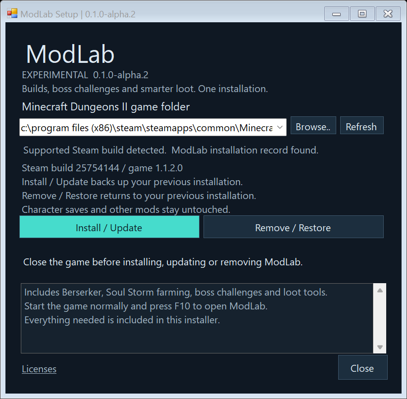

# ModLab

**More builds. More bosses. Better loot.**

ModLab is an all-in-one gameplay and quality-of-life mod suite for **Minecraft
Dungeons II**. Build a persistent Berserker, farm repeatable Soul Storms, take
on boss challenges and manage loot with rules you control.

Everything is managed through one English **F10 menu**, embedded in the game.
Your settings and character progression remain saved between sessions.

## Download and install

**[Download ModLab-Setup-0.1.0-alpha.2.exe](https://github.com/falorfrozen-cmd/ModLab/releases/download/modlab-v0.1.0-alpha.2/ModLab-Setup-0.1.0-alpha.2.exe)**

[Release notes and checksums](https://github.com/falorfrozen-cmd/ModLab/releases/tag/modlab-v0.1.0-alpha.2)

1. Close Minecraft Dungeons II.
2. Run **ModLab-Setup-0.1.0-alpha.2.exe**.
3. Select your game folder. Steam libraries on other drives are detected
   automatically; **Browse** supports custom locations.
4. Click **Install / Update**.
5. Start the game through Steam and press **F10**.

**One installer includes everything needed.** There is no second installation
and no desktop ModLab application to run during gameplay.

Current alpha target: **Windows x64, Steam build 25754144 / game 1.1.2.0**.
Primarily tested offline. See [compatibility and known issues](#compatibility-and-known-issues).

## Feature overview

| Feature | What you can do |
| --- | --- |
| [Berserker](#berserker-class) | Build a persistent melee class with Rage, talents, active skills and animated buffs. |
| [Soul Storm](#soul-storm-farming) | Repeat Storms, expand earned chest rewards and travel to generators from the map. |
| [Boss challenges](#boss-rush-and-boss-roulette) | Choose fixed or shuffled boss sequences and earn Enchantment Book rewards. |
| [Dungeon/Rift Directors](#dungeon-and-rift-directors) | Add extra miniboss encounters during exploration. |
| [Smart Filter + Auto Sell](#smart-filter--auto-sell) | Keep or sell gear by rarity, with optional Power protection and a sale preview. |
| [Wanted Items](#wanted-items--loot-wishlist) | Protect and track specific gear targets, including items you have not found. |
| [Enchant Workshop](#enchant-workshop) | Apply, upgrade and remove compatible enchantments using the game's rules. |
| [Quality of life](#quality-of-life-tools) | Adjust pickup, movement, attack speed, arrows, reward multipliers and fast travel. |
| [Expanded Wallet](#expanded-wallet) | Store more earned Emeralds and Echo Shards without granting free currency. |
| [Combat reports](#combat-meter-and-run-reports) | Track DPS, damage, valuable drops and Auto Sell income. |
| [Headhunter](#headhunter-relic--experimental) | Temporarily steal supported powers from defeated Soul-Enchanted enemies. |

## Berserker class

Build a melee character around Rage, empowered melee hits and
temporary combat buffs.

- Generate Rage through melee hits, incoming damage and kills.
- Earn Mastery XP from combat and progress through 20 class levels.
- Spend talent points across 12 talents in three branches.
- Save three talent and hotkey loadouts per character.
- Respec talents without losing Mastery progress.
- Rebind both active skills.

| Skill | Default key | What it does |
| --- | --- | --- |
| War Cry | H | Available at level 1. Spend 20 Rage for 6 seconds of increased melee damage and armor. |
| Rampage | V | Spend full Rage for a burst of melee attack speed and damage. |

### Talent branches

- Blood: kill healing, Second Wind sustain, Predator's Edge finishing damage and Crimson Feast empowered hits.
- Fury: attack speed, extra Rage, Rising Fury damage from stored Rage and extended Rampage.
- Juggernaut: armor, defensive Rage generation and stronger War Cry.

### Passive highlights

| Passive | Effect |
| --- | --- |
| Second Wind | Melee hits heal 0.4% maximum health per rank, at most once per second. |
| Predator's Edge | Melee hits deal 6% additional damage per rank when the target is left at 35% health or less. |
| Crimson Feast | Every fifth melee hit deals 25% additional damage and heals 3% maximum health, at most once every 2 seconds. |
| Rising Fury | Each full 25 Rage adds 2% melee damage per rank, capped at 8% per rank. Spending Rage lowers the bonus. |
| Warbringer | War Cry lasts 1 second longer and grants 5% additional armor per rank. |

Existing talent investments, character progression and saved builds remain valid.

### Buff HUD and effects

See your Rage, two skill hotkeys, cooldowns, remaining buff durations,
Rising Fury damage bonus and Crimson Feast five-hit progress.
War Cry and Rampage have separate timers, duration bars and animated
character effects. Timers pause with the offline game.

Class selection, Mastery, talents, Ascension and loadouts are saved
for each character. Temporary combat buffs clear on death or travel.

### Ascension: Trial of Fury

At Berserker level 5, start the Trial in a suitable Dungeon or Rift room.

Defeat Soul Witch, Supreme Evoker and Redstone Monstrosity in one attempt.
No War Cry or Rampage casts are required. Death, leaving or abandoning ends
the attempt.

Passing awards 200 Mastery XP and permanent Ascension for that character.
All Ascension talents unlock immediately after passing, with no extra
Mastery level requirement. Learning a talent uses the normal branch
prerequisites and talent points. Recorded three-boss completions from older
versions automatically receive Ascension and its one-time XP reward.

## Soul Storm farming

### Endless Soul Storm

Choose one of seven supported regions for repeatable Soul Storms.

Destroy all three generators, collect the completion reward and begin
another cycle after a 15-second interval. Switching regions ends the
previous Storm before starting the new one.

### More chest rewards

Set generator chest rolls and completion chest rolls independently,
from 1× to 10×.

For example, 3× produces three independent rewards from that chest's
reward tier. Rarity continues to be rolled normally.

### All-region Soul Storm loot

Combine native item pools from ten regions, covering 99 base item
families and their variants.

This expands the gear available from earned Soul Storm chests while
preserving native Power, rarity, Soul Storm properties and bonus effects.

### Generator convenience

- Show active generators on the map outside normal discovery range.
- Click an active generator on the M map to travel beside it.
- Optionally prevent the three protective shield pylons from appearing.
- Remove existing pylons when the shield option is enabled.

## Boss Rush and Boss Roulette

Create a sequence of 1–6 boss fights in a suitable Dungeon or Rift room.

The current pool contains:
- Soul Witch
- Supreme Evoker
- Redstone Monstrosity

Boss Rush uses a fixed order. Boss Roulette shuffles each set of three
and avoids consecutive repeats. Each fight includes preparation time.

### Rewards

- Bosses retain their normal loot.
- Each defeated boss adds a reward chest with one random eligible
  Enchantment Book you do not already own.
- Quest books are excluded.
- Complete a 1–3 boss run for one bonus chest.
- Complete a 4–6 boss run for two bonus chests.

Death, leaving or abandoning ends the run without its completion bonus.

## Dungeon and Rift Directors

Add extra miniboss encounters during exploration.

- Enable Dungeon Director and Rift Director separately.
- Choose up to eight extra minibosses per expedition.
- Adjust the minimum time between encounters.
- Fight one additional miniboss at a time.
- Main boss arenas and crowded rooms are protected.

Director encounters pause during Boss Rush.

## Smart Filter + Auto Sell

Choose Keep or Sell separately for:
Common, Rare, Special, Unique and Gilded gear.

Auto Sell follows the filter's saved decisions and salvages unwanted
gear for Emeralds.

### Optional Power protection

Enable a minimum Power threshold to protect stronger gear.

Disable “Use Power filter” to sell the selected rarities at any Power.
Other protection rules still apply.

### Protection and preview

- Equipped gear is always protected.
- Optionally protect favorites, enchanted gear and artifacts.
- Matching Wanted Items can override general sale rules.
- Preview which items will sell, stay or cannot be sold.
- See the reason for each decision and its Emerald reward.

The preview does not sell anything. Save your rules and resume gameplay
to begin automatic sales.

## Wanted Items / Loot Wishlist

Track up to 16 gear targets, including items you have not found yet.

Choose the item, target rarity and minimum Power. Matching drops can
be protected from Auto Sell and announced when found.

Targets remain active until removed or disabled.

## Enchant Workshop

Manage owned melee weapons, ranged weapons and armor, including
equipped gear.

- Search your equipment by name.
- Select a compatible Enchantment Book you own.
- Apply or upgrade an enchantment.
- Remove an enchantment and receive the game's applicable refund.

The Workshop uses the game's costs and compatibility rules.

## Quality-of-life tools

- Auto pickup with adjustable range and delay.
- Automatic opening of nearby chests.
- Auto pickup skips TNT and throwable objects.
- M-map travel to Dungeon/Rift entrances, minecarts and active generators.
- F2–F6 camp shortcuts.
- Infinite arrows.
- Adjustable bow recharge speed.
- Adjustable movement and melee/ranged attack speed.
- XP and currency gain multipliers.
- Adjustable additional item drop chance.

Drop chance uses added percentage points: +10 means ten additional
percentage points.

## Expanded Wallet

Increase capacity to:
- 1,000,000 Emeralds
- 10,000 Echo Shards

Enable it with one checkbox. It increases capacity without granting
currency. Saved overflow balances survive restarts.

## Combat meter and run reports

Monitor rolling DPS, total damage and your latest hit.

Expedition reports include:
- Duration, deaths and observed kills
- Extra minibosses defeated
- Total damage, peak DPS and expedition average DPS
- Gear found and valuable drops
- Auto Sell item counts and Emerald rewards

Boss Rush reports also record boss order, bosses defeated and reward
chests. Recent run histories remain saved.

## Headhunter Relic — Experimental

Equip Headhunter from the Relics page to steal supported powers from
Soul-Enchanted enemies you defeat.

- Each power lasts 30 seconds.
- Up to six different powers can remain active.
- Repeated powers refresh their duration.
- A seventh power replaces the one closest to expiry.
- The HUD displays remaining time.
- Temporary powers clear on death, travel or unequip.

Supported powers include Poison, Ice, Lightning, Fire, Melee, Ranged,
Speed, Health, Soul Orbs, Soul Leech, Soul Ripple and Soul Suppression.

Monster powers are adapted into player stat buffs. Elemental powers
boost matching damage already present in your build.

Controlled native tests and theft events in a real play session have
been observed. Wider natural-encounter coverage is still being verified.

## Controls

| Key | Action |
| --- | --- |
| F10 | Open or close ModLab |
| F8 | Open Enchant Workshop |
| H / V | Default Berserker skills: War Cry / Rampage |
| M | Open the map for supported fast travel |
| F2–F6 | Camp shortcuts |
| Esc | Close ModLab |

## Updating and removing ModLab

Run the same ModLab Setup again:

- **Install / Update** updates the complete installation together.
- **Remove / Restore** returns to the installation present before the first
  ModLab Setup run.

Existing ModLab files and known conflicting Blueprint packages are backed up
under the game's **ModLabBackups** folder, outside mounted Paks. Existing
standalone bootstrap installations are adopted automatically. Keep those
backups if you need restoration. Do not recreate or delete ownership records.

Character saves, persisted settings and unrelated mods are not changed by
Setup. If an older ModLab version was installed before Setup, restoration
brings that version back. Damaged records or modified owned files are rejected.

Setup is portable: keep it or redownload it for removal. It has no Windows
Apps entry or background service. The EXE is unsigned; verify downloads
against the release's **SHA256SUMS.txt**.

Playing needs no NeoRune SDK, Python or .NET SDK. Installation uses Windows'
built-in PowerShell 5.1 and .NET Framework 4.8. Developer self-test scenarios,
probe mods, SDKs and player saves are excluded from the player package.

## Compatibility and known issues

- Experimental alpha for **Steam build 25754144 / game 1.1.2.0** on Windows x64.
- Designed and tested primarily for offline single-player.
- Other game builds, launchers and multiplayer are not verified.
- Headhunter remains experimental; broader natural-encounter coverage is ongoing.
- Direct travel to the final Dungeon/Rift ambush is unavailable in this build.
- An intermittent **0xC0000005 on game shutdown** remains open. It has also
  occurred in package-free controls. ModLab does not claim to fix it.

[Validation details](docs/MODLAB-VALIDATION.md) distinguish feature checks,
installer checks and shutdown results. No unverified feature is presented as
fully certified.

## Reporting an issue

Open a [GitHub issue](https://github.com/falorfrozen-cmd/ModLab/issues) and include
ModLab version, game build, the affected feature, other installed mods and the
steps to reproduce the problem. Screenshots and the exact error help. Do not
include character saves or account details unless you intend to share them.

## Development

This public repository contains the bootstrap and standalone installer source,
plus ModLab player documentation and complete player releases. The broader
gameplay source is maintained separately. Source provided here is MIT-licensed;
that does not relicense the full gameplay package or its artwork.

[Bootstrap reference](docs/BOOTSTRAP.md) · [Build tools](docs/BUILDING.md) ·
[Runtime validation](docs/RUNTIME-VALIDATION.md) · [Third-party notices](THIRD-PARTY-NOTICES.md)

Unofficial fan project. Not affiliated with the game's developers or publishers.
