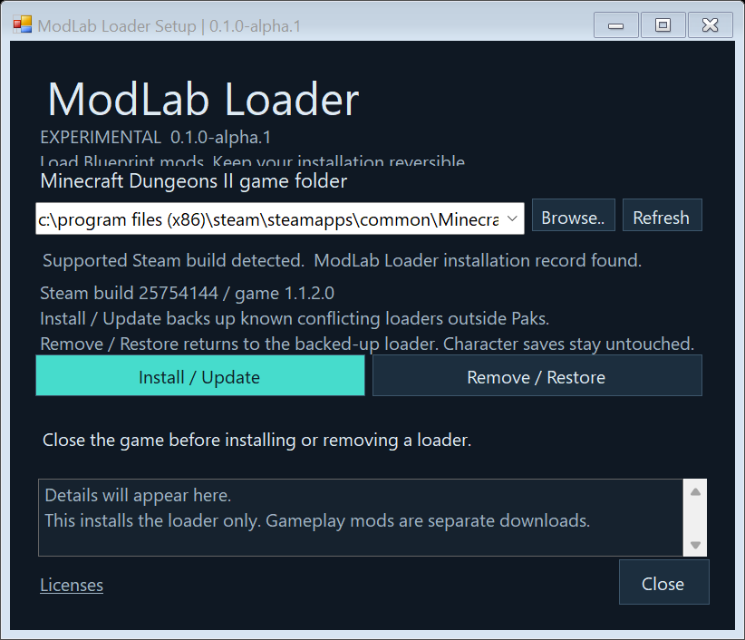

# ModLab Loader

An independent, lightweight Blueprint mod loader for **Minecraft Dungeons II**.

**0.1.0-alpha.1 is an experimental release for Steam build 25754144 / game
1.1.2.0 / Unreal Engine 5.6.1.** Other builds, Xbox/Game Pass and multiplayer
have not been validated.

## Download and install

Get the files from [GitHub Releases](https://github.com/falorfrozen-cmd/Minecraft-Dungeons-II-ModLab-Loader/releases).

1. Close Minecraft Dungeons II.
2. Run `ModLabLoader-Setup-0.1.0-alpha.1.exe`.
3. Select your game folder. Setup detects Steam libraries on other drives;
   **Browse** also lets you select the folder containing `Dungeons`.
4. Click **Install / Update**. Windows may request administrator permission to
   write to the game folder. Start the game normally through Steam afterwards.

Setup is a portable installation tool. Run the same EXE again and select
**Remove / Restore** to remove this loader and restore any loader it backed up.
It does not add a background service or a Windows Apps entry. Keep the EXE or
download it again when you want to uninstall.



Known `BlueprintLoader_P.*` and `BetterBlueprintLoader_P.*` conflicts are
preserved in the game's `ModLabBackups` folder, **outside mounted Paks**.
Only installation-owned, hash-verified files are changed on update or removal.
Modified or incomplete installation records are rejected. Character saves and
other mods are not modified. Backups stay available after removal.

Setup is not code-signed. Windows may display an unknown-publisher or SmartScreen
message. Verify the download against `SHA256SUMS.txt`; a manual ZIP is available
if you prefer copying the files yourself.

The installer uses Windows' built-in PowerShell 5.1 and .NET Framework 4.8
(included in current Windows 10/11). Playing requires only the three loader
package files: players do not install NeoRune, Python or a .NET SDK.

## Manual installation

Extract the `ModLabLoader` folder from `ModLabLoader-Manual-0.1.0-alpha.1.zip`
into `Dungeons/Content/Paks/~mods/`:

```text
~mods/ModLabLoader/ModLabLoader_P.pak
~mods/ModLabLoader/ModLabLoader_P.utoc
~mods/ModLabLoader/ModLabLoader_P.ucas
```

Use **one loader at a time**. With manual installation, move any other loader's
package files completely outside `Paks` before installing this one. Renaming a
folder inside `Paks` is not a reliable way to disable a package. The manual ZIP
does not create Setup's restore record. To remove a manually installed copy,
remove only these three loader files while the game is closed, then put your
previous loader back if needed.

## What it does

- Loads conventional `/Game/Mods/<ModId>/ModActor.ModActor_C` entry points.
- Discovers mods generically; ModLab is not hard-coded into the loader.
- Checks for existing actors to avoid duplicate startup in a world.
- Performs one bounded startup pass per world, then stops the loading queue.
- Has no recurring scan, per-frame loader tick, DLL injection or desktop process
  during gameplay. The runtime package is approximately **40 KiB**.
- Supports an optional diagnostic trace and a command-line skip list.

This package contains **the loader only**. ModLab's gameplay features, F10
interface, Berserker class and other mods are separate downloads. The loader
does not display a permanent startup watermark. Confirm it through a loaded
mod, or enable diagnostics to check the startup trace.

## Scope and limitations

This is an independent implementation, not a renamed or bundled Blueprint
Loader. It is not a complete replacement for every mod-loading ecosystem API:
Blueprint Loader's shared settings menu and popup API are not implemented.
Dependency/start-order metadata and automatic crash quarantine are also absent.
Mods relying on those APIs need their original loader. Native DLL mods are not
supported. No performance improvement over other loaders is claimed.

The bootstrap overlays `/R1/R1` through the game's Game Features system while
preserving the original action payloads and scan settings. Original game
containers are not edited. Another mod overriding the same asset can conflict.
The build adapter checks the original asset fingerprint and rejects unfamiliar
layouts; new game updates require inspection and validation.

## Troubleshooting

Add `-ModLabLoaderDiagnostics` in Steam's launch options to record startup in
`Dungeons2/Saved/SaveGames/NeoRune_ModLabLoader.sav`. Normal play produces no
loader log save. This trace does not catch arbitrary native crashes in mods.

Use `-ModLabLoaderSkip=ExampleA,ExampleB` to skip specific mod IDs. IDs are
case-sensitive and refer to the asset folder under `/Game/Mods`. Restart the
game after changing packages or launch options.

For an issue, include the game build, platform, loader version, other installed
mods and the steps to reproduce it. Do not upload character saves unless you
intend to share them.

## Development

See [BUILDING.md](docs/BUILDING.md), [runtime validation](docs/RUNTIME-VALIDATION.md)
and [installer validation](docs/INSTALLER-VALIDATION.md). The installer can be
built independently of the mod compiler from a verified runtime package.

Our source is MIT-licensed. NeoRune helper attribution is retained in
[`NeoRune-LICENSE.txt`](mods/ModLabLoader/Branding/NeoRune-LICENSE.txt).
See [third-party notices](THIRD-PARTY-NOTICES.md).

Unofficial fan project. Not affiliated with Mojang, Microsoft or Epic Games.
